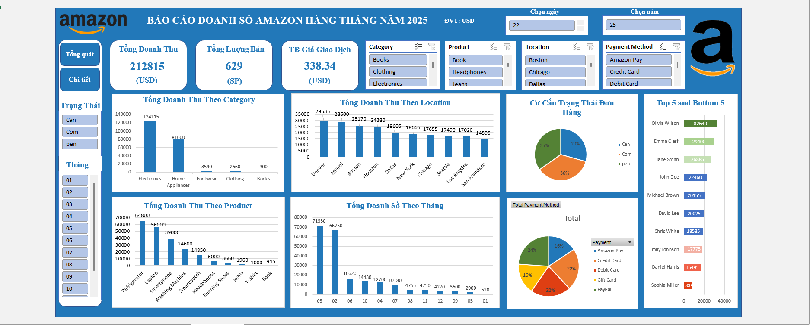
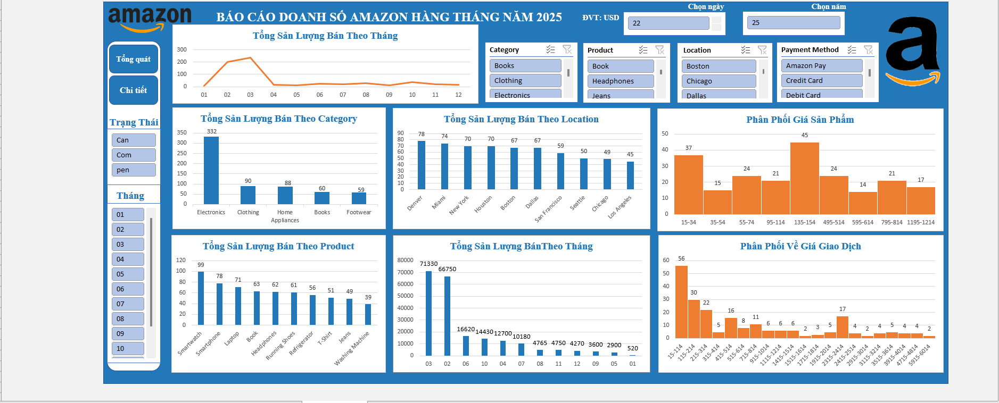

## Project Title: Phân tích dữ liệu doanh số bán hàng của Amazon năm 2025 theo tháng

Công cụ sử dụng: Microsoft Excel (Power Query, Pivot Table, Advanced Charts).

### 1. Mục tiêu dự án (Objective)

Phân tích dữ liệu doanh số bán hàng của Amazon năm 2025, rút ra insight và đưa ra recomendations cho quyết định của công ty

Xây dựng dashboard tương tác động, giúp quản lý và theo dõi doanh số bán hàng Amazon theo tháng

### 2. Quy trình thực hiện (Workflow)

Data collection: Thu thập dữ liệu từ kaggle, tập dữ liệu về doanh số bán hàng của Amazon năm 2025

Data Cleaning: Xử lý dữ liệu khuyết (Missing values), xử lý dữ liệu trùng lặp (duplicate values), chuẩn hóa các kiểu dữ liệu

Data Analysis: Sử dụng Pivot Tables để trích xuất các chỉ số quan trọng như tổng doanh thu theo category, tổng doanh thu theo product, tổng doanh thu theo location. Tính toán các chỉ số KPIS như tổng doanh thu, tổng sản lượng bán và trung bình giá tiền trên 1 giao dịch.

Data Visualization: Thiết kế Dashboard tương tác với các Slicer giúp người dùng lọc dữ liệu theo thời gian và danh mục sản phẩm, giúp quản lý có thể theo dõi doanh số bán hàng theo tháng.

### 3. Các Insights quan trọng

Trong 5 nhóm sản phẩm mà công ty đang kinh doanh, hai nhóm sản phẩm mang lại doanh thu tốt nhất là Electronics và Home appliances với doanh thu lần lượt là 124115$ chiếm 58% tổng doanh thu và 81600$ chiếm 38,3% tổng doanh thu, riêng hai nhóm sản phẩm này đã chiếm hơn 96% tổng doanh thu, 3 nhóm sản phẩm còn lại là Footwear, clothing và books mang lại doanh thu rất thấp dao động từ 900$ - dưới 3000$, cả ba nhóm sản phẩm này mới chiếm đến 4% tổng doanh thu.

Doanh thu tăng mạnh ở tháng 2 và tháng 3 với lần lượt doanh thu là 66750$ và 71330$, doanh thu tháng 2 và tháng 3 chiếm 65% tổng số doanh thu, trong khi đó doanh số giảm mạnh ở tháng 1 với doanh thu là 520$ trong khi các tháng khác doanh thu đều trên 2000$ .

Tổng sản lượng bán của home appliances và clothing đều chiếm khoảng 30% tổng sản lượng bán (88 và 90), thậm chí home appliances còn kém clothing 2 sản phẩm, tuy nhiên doanh thu của Home appliances lại chiếm đến gần 40% tổng doanh thu trong khi clothing chỉ chiếm có 1,2% tổng doanh số, điều này là bất thường vì đặc thù giá sản phẩm của cả đồ gia dụng và quần áo dều tương tương nhau thậm chí quần áo còn có giá cao hơn, điều này cho thấy tỷ lệ chuyển đổi của nhóm sản phẩm clothing là rất thấp   

### 4. Các Recomendations quan trọng

Có thể nghiên cứu loại bỏ các nhóm sản phẩm có tình hình kinh doanh không hiệu quả (footwear, book) để tập chung vào các nhóm sản phẩm có tình hình kinh doanh tốt và được yêu thích, chấp nhận bởi thị trường (Home appliance và Electronics)

Hệ thống xử lý đơn hàng đang làm việc vô cùng tệ, cần cải thiện hệ thống xử lý đơn hàng ngay để tăng tỷ lệ hoàn thành đơn hàng và giảm tỷ lệ xử lý và hủy hàng 

Cần nghiên cứu lại về các sản phầm thuộc nhóm clothing, nhóm sản phẩm này có sản lượng bán tốt nhưng doanh số lại quá thấp, cần có phương án để tăng tỷ lệ chuyển đổi, như cân bằng lại về giá, giảm giá nhập vào, tối ưu chi phí vận hành

Tháng 2 và tháng 3 doanh số tăng mạnh rất đáng ấn tượng, tuy nhiên doanh số các tháng khác thì lại rất thấp, doanh số tháng 1 thậm chí còn dưới 1000$, điều này là ko hợp lý vì sản phẩm của công ty là sản phẩm bán quanh năm, không phải loại sản phẩm bán theo màu vụ, cần nghiên cứu lại về thị trường, các chiến dịch marketing, để đảm bảo doanh số tăng đều phát triển bền vững 
(Xem tri tiết insight và recomendation trong file Amazon_Sales_Analysis_V1.xlsx)

### 5. Hình ảnh Dashboard
Dashboard tab1

Dashboard tab2

